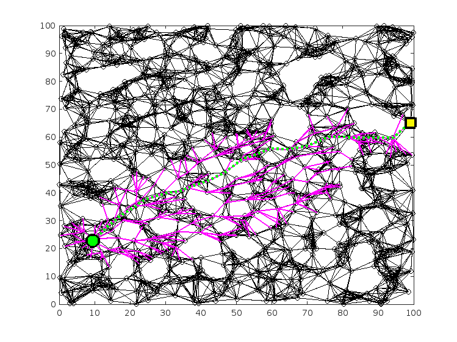

# ENAE788V Motion Planning Homework
This repository will implement several classic motion planning algorithms. 

|Homework|Description|
|-----|-----|
|hw1|A\* algorithm|
|hw2|RRT algorithm| 

## hw1: A\* algorithm
|Color|Description|
|-----|-----|
|Green circle|Start|
|Yello square|Goal|
|Green dash|Path|
|Purple line|Search tree| 

