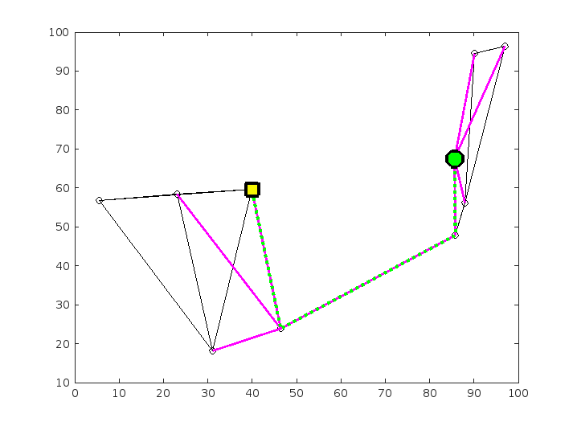
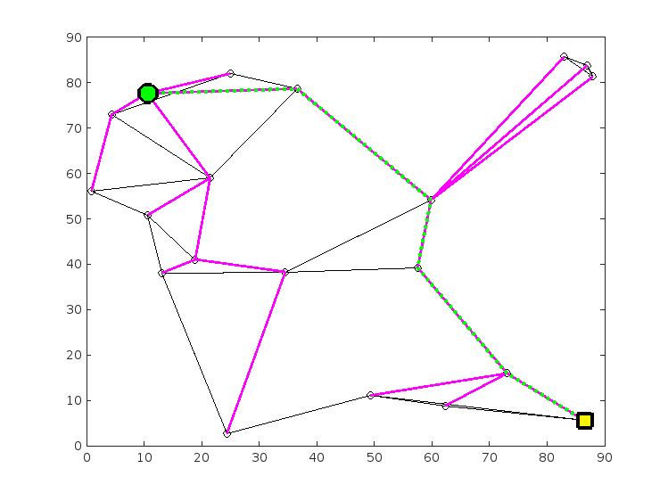
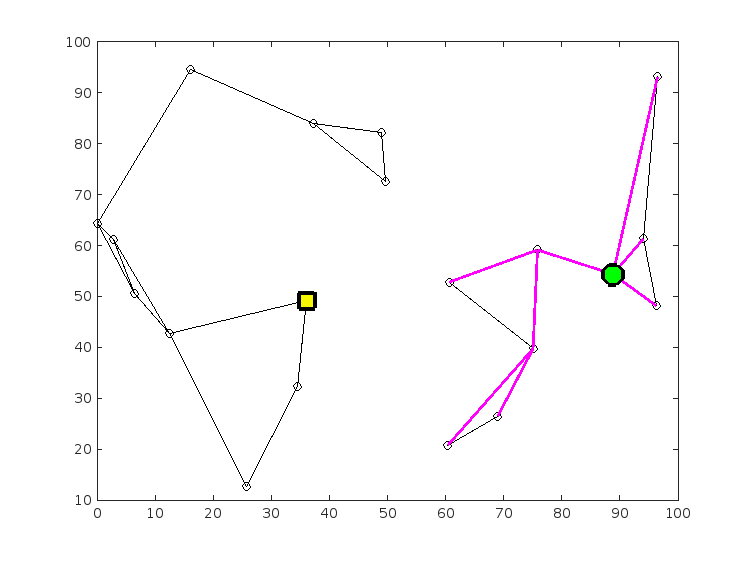
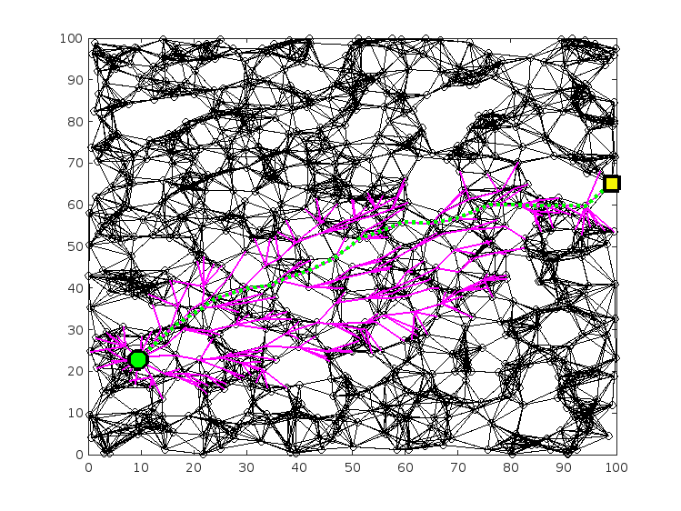
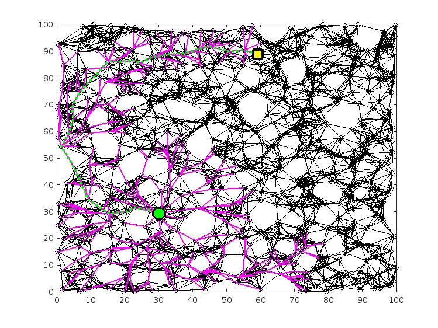

# ENAE788V Hw1: Implement the A\* Algorithm
This homework implements the A\* algorithm on a 2D graph with a point robot.  

The priority queue used in the project is from the C++ Standard Template Library(STL).

## File Structure
The given problem related files including nodes file and edges file are in the data folder.  
The results including the path file, search tree file, and the graph are in the results folder.  

```
├── README.md
└── hw1
    ├── CMakeLists.txt
    ├── README.md
    ├── data
    │   ├── edges_with_costs_1.txt
    │   ├── edges_with_costs_2.txt
    │   ├── edges_with_costs_3.txt
    │   ├── edges_with_costs_4.txt
    │   ├── edges_with_costs_5.txt
    │   ├── nodes_1.txt
    │   ├── nodes_2.txt
    │   ├── nodes_3.txt
    │   ├── nodes_4.txt
    │   ├── nodes_5.txt
    │   └── problems.txt
    ├── include
    │   ├── problem.h
    │   └── solver.h
    ├── results
    │   ├── Problem1
    │   │   ├── Problem1_graph.png
    │   │   ├── Problem1_path.txt
    │   │   └── Problem1_search_tree.txt
    │   ├── Problem2
    │   │   ├── Problem2_graph.png
    │   │   ├── Problem2_path.txt
    │   │   └── Problem2_search_tree.txt
    │   ├── Problem3
    │   │   ├── Problem3_graph.png
    │   │   ├── Problem3_path.txt
    │   │   └── Problem3_search_tree.txt
    │   ├── Problem4
    │   │   ├── Problem4_graph.png
    │   │   ├── Problem4_path.txt
    │   │   └── Problem4_search_tree.txt
    │   └── Problem5
    │       ├── Problem5_graph.png
    │       ├── Problem5_path.txt
    │       └── Problem5_search_tree.txt
    ├── scripts
    │   └── run_problems.sh
    └── src
        ├── main.cpp
        ├── problem.cpp
        └── solver.cpp
```

## Environment
Ubuntu 20.04 in WSL2
### Dependency
- C++17
- CMake

## Build
Build with CMake
```
mkdir build && cd build
cmake ..
make -j
```

## Run 
Run single problem  
The input is `problem number, start_id, goal_id`.  

```
./solution 1 9 5
```
Run all problems
```
./run_problem
```

## Results
|Color|Description|
|-----|-----|
|Green circle|Start|
|Yello square|Goal|
|Green dash|Path|
|Purple line|Search tree| 

- Problem 1  


- Problem 2  


- Problem 3  
There is no solution in problem 3.


- Problem 4  


- Problem 5  
The edges in problem 5 is non-euclidean.

