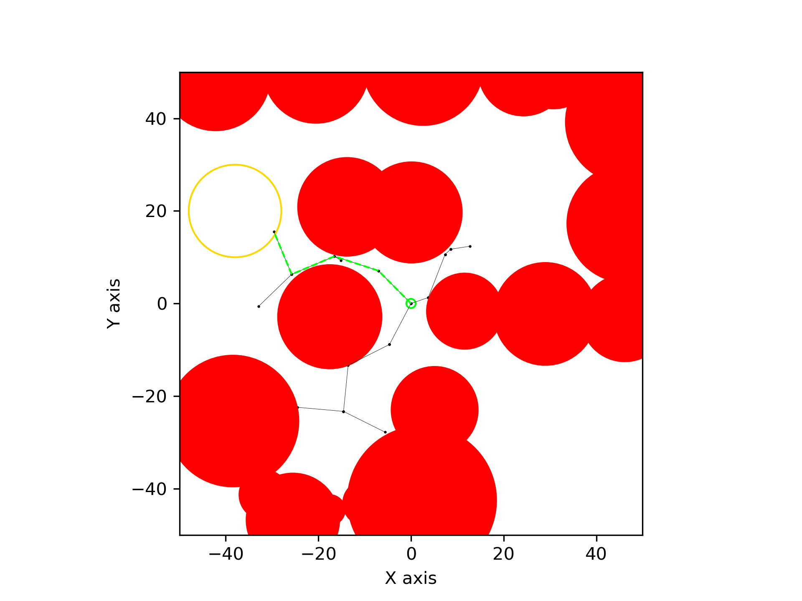
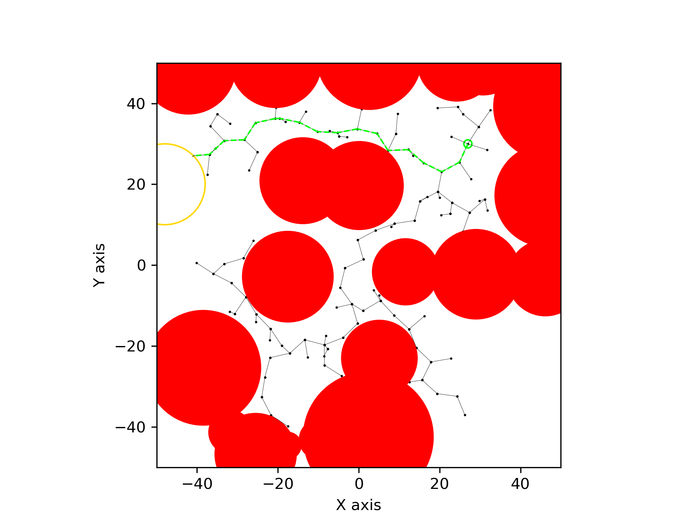
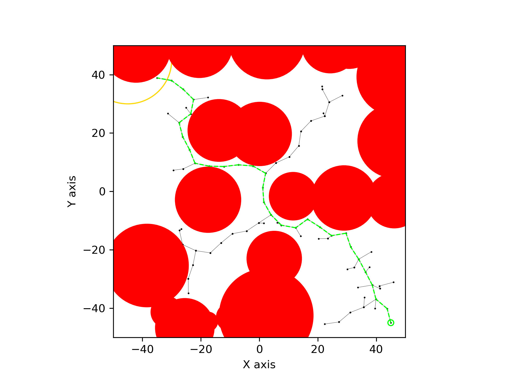
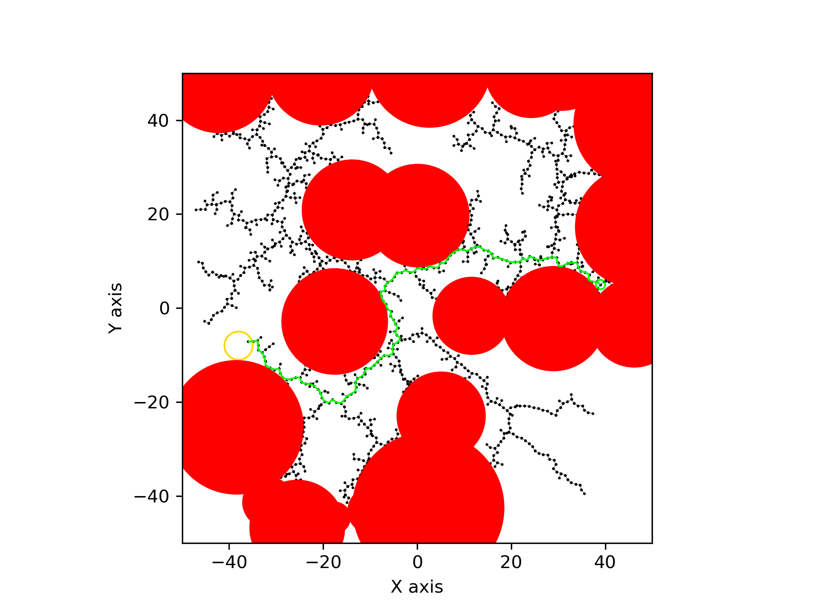

# ENAE788V Hw2: Implement the RRT Algorithm
This homework implements the RRT algorithm on a 2D workspace with obstacles using a point robot.  

## File Structure
The given problem related files including obstacles file and problem file are in the data folder.  
The results including the path file, search tree file, and the graph are in the results folder.  

```
├── CMakeLists.txt
├── README.md
├── data
│   ├── H2.txt
│   └── obstacles.txt
├── include
│   ├── problem.h
│   └── solver.h
├── results
│   ├── Problem1
│   │   ├── Problem1_graph.png
│   │   ├── Problem1_path.txt
│   │   └── Problem1_search_tree.txt
│   ├── Problem2
│   │   ├── Problem2_graph.png
│   │   ├── Problem2_path.txt
│   │   └── Problem2_search_tree.txt
│   ├── Problem3
│   │   ├── Problem3_graph.png
│   │   ├── Problem3_path.txt
│   │   └── Problem3_search_tree.txt
│   ├── Problem4
│   │   ├── Problem4_graph.png
│   │   ├── Problem4_path.txt
│   │   └── Problem4_search_tree.txt
│   └── Problem5
│       ├── Problem5_graph.png
│       ├── Problem5_path.txt
│       └── Problem5_search_tree.txt
├── scripts
│   ├── draw_rrt.py
│   └── run_problems.sh
└── src
    ├── main.cpp
    ├── problem.cpp
    └── solver.cpp
```

## Environment
Ubuntu 20.04 in WSL2
### Dependency
- C++17
- CMake

## Build
Build with CMake
```
mkdir build && cd build
cmake ..
make -j
```

## Run 
Run single problem    
The input is `problem number, start x, start y, goal_x, goal_y, goal_tolerance, rrt_epsilon`.  

```
./solution 1 0 0 -38 20 10 10
```

Plot single problem (After run single problem)  
The input is `problem number, start x, start y, goal_x, goal_y, goal_tolerance`.  
```
python3 draw_rrt.py 1 0 0 -38 20 10
```

Run all problems and plot graphs
```
./run_problems.sh
```

## Results
|Color|Description|
|-----|-----|
|Red|Obstacle|
|Green Circle|Start|
|Yello Circle|Goal|
|Green dash|Path|
|Black line|Search tree| 

- Problem 1  
epsilon = 10  


- Problem 2  
epsilon = 5  


- Problem 3  
epsilon = 5  


- Problem 4  
epsilon = 2  


- Problem 5  
epsilon = 1  



