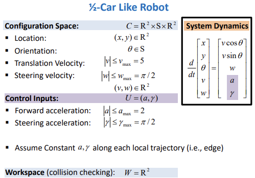
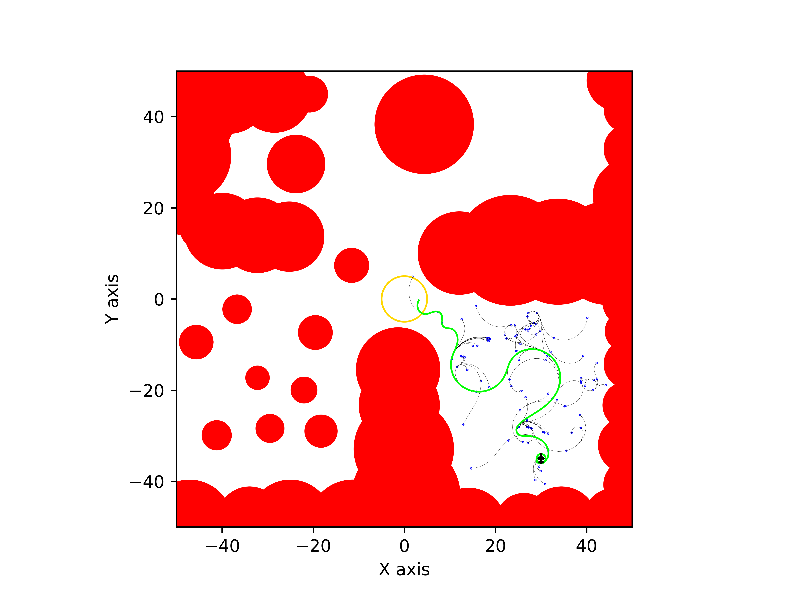
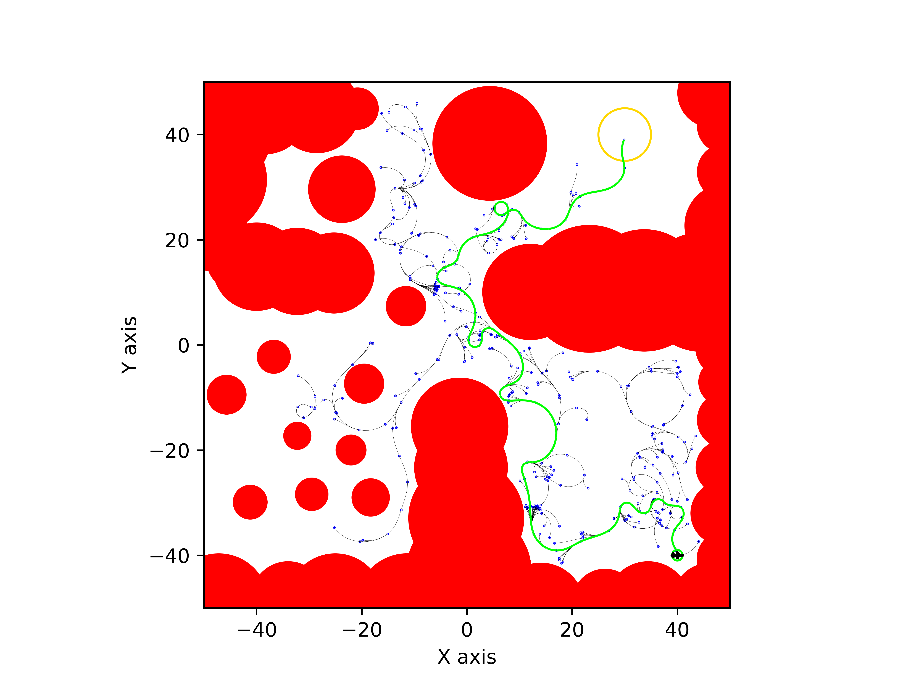
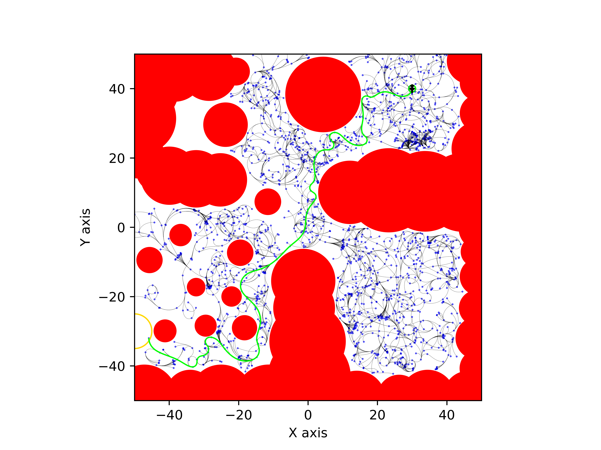
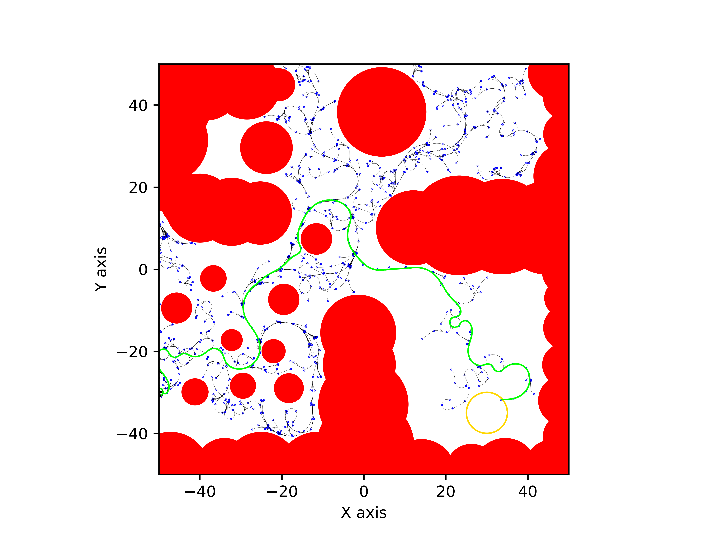
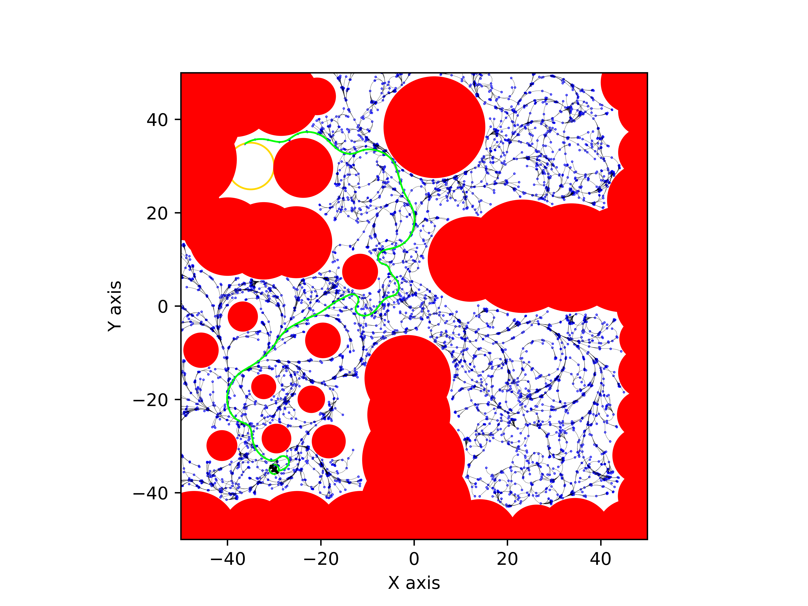

# ENAE788V Hw3: Implement the RRT Algorithm with robot dynamic and volume
This homework implements the RRT algorithm on a 2D workspace with obstacles using a robot with half-car like dynamic.  

The dynamic is as follow:  

<p align="center">
    
</p>

## Implementation
This program implements the one-point boundary value approach to robot dynamics and expands nodes in the RRT tree through forward simulation using numerical methods.
The [Drake](https://drake.mit.edu/) simulator is used to solve the differential equation for the forward simulation.

The resolution of collision checking for every edge is under a constant length δ = 0.5.   

To create a smoother path, the program implemented more restricted velocity and angular velocity constraints, resulting in smaller magnitudes for both velocities.
And the robot is only allowed to go forward with a positive velocity.


## File Structure
The given problem related files including obstacles file, robot file, and problem file are in the data folder.  
The results including the path file, search tree file, nodes_file, and graphs are in the results folder.    
The path file is the csv file in each problem folder.

```
├── CMakeLists.txt
├── README.md
├── data
│   ├── H3.txt
│   ├── H3_robot.txt
│   ├── obstacles.txt
│   └── robot_dynamic.png
├── include
│   ├── problem.h
│   ├── robot.h
│   └── solver.h
├── results
│   ├── Problem1
│   │   ├── Problem1_graph.gif
│   │   ├── Problem1_graph.png
│   │   ├── Problem1_nodes.txt
│   │   ├── Problem1_path.csv
│   │   ├── Problem1_path.txt
│   │   └── Problem1_search_tree.txt
│   ├── Problem2
│   │   ├── Problem2_graph.gif
│   │   ├── Problem2_graph.png
│   │   ├── Problem2_nodes.txt
│   │   ├── Problem2_path.csv
│   │   ├── Problem2_path.txt
│   │   └── Problem2_search_tree.txt
│   ├── Problem3
│   │   ├── Problem3_graph.gif
│   │   ├── Problem3_graph.png
│   │   ├── Problem3_nodes.txt
│   │   ├── Problem3_path.csv
│   │   ├── Problem3_path.txt
│   │   └── Problem3_search_tree.txt
│   ├── Problem4
│   │   ├── Problem4_graph.gif
│   │   ├── Problem4_graph.png
│   │   ├── Problem4_nodes.txt
│   │   ├── Problem4_path.csv
│   │   ├── Problem4_path.txt
│   │   └── Problem4_search_tree.txt
│   └── Problem5
│       ├── Problem5_graph.gif
│       ├── Problem5_graph.png
│       ├── Problem5_nodes.txt
│       ├── Problem5_path.csv
│       ├── Problem5_path.txt
│       └── Problem5_search_tree.txt
├── scripts
│   ├── draw_rrt.py
│   ├── draw_rrt_movie.py
│   └── run_problems.sh
├── src
│   ├── main.cpp
│   ├── problem.cpp
│   ├── robot.cpp
│   └── solver.cpp
└── test
    ├── test_eigen.cpp
    ├── test_problem.cpp
    └── test_robot.cpp
```

## Environment
Ubuntu 20.04 in WSL2
### Dependency
- C++17
- CMake
- [Eigen](https://eigen.tuxfamily.org/index.php?title=Main_Page) (For matrix calculation)
- [Drake](https://drake.mit.edu/) (For numerical simulation)

## Install
Follow this [page](https://drake.mit.edu/apt.html#stable-releases) to install Drake

## Build
Build with CMake
```
mkdir build && cd build
cmake ..
make -j
```

## Run 
Run single problem    
The inputs are `problem_number, start_x, start_y, start_theta, goal_x, goal_y, goal_tolerance, rrt_epsilon`.  

```
./solution 1 30 -35 1.57 0 0 5 10
```

Plot single problem (After run single problem)  
The inputs are `problem_number, start_x, start_y, start_theta, goal_x, goal_y, goal_tolerance`.  
```
python3 draw_rrt.py 1 30 -35 1.57 0 0 5
```

Plot gif
The inputs are `problem_number, start_x, start_y, start_theta, goal_x, goal_y, goal_tolerance`.  
```
python3 draw_rrt_movie.py 1 30 -35 1.57 0 0 5
```

Run all problems and plot graphs
```
./run_problems.sh
```

> :warning: Due to the goal position in problem 5, the program sometimes take longer time to compute a solution. It is also possible that there is no solution within the time limit.  

## Results
| Color          | Description |
|----------------|-------------|
| Red            | Obstacle    |
| Green Circle   | Start       |
| Yello Circle   | Goal        |
| Green Line     | Path        |
| Black Line     | Search tree |
| Blue Dots      | RRT nodes   |
| Black Airplane | Robot       |

- Problem 1  
  epsilon = 10  
  

  Time step between each plane is 2 seconds. 
  


- Problem 2  
  epsilon = 5  
  
 
  Time step between each plane is 2 seconds. 
  


- Problem 3  
  epsilon = 5  
  
  
  Time step between each plane is 2 seconds. 
  

- Problem 4  
  epsilon = 3  
  
  
  Time step between each plane is 2 seconds. 
  

- Problem 5  
  epsilon = 2  
  
  
  Time step between each plane is 2 seconds. 
  

## Reference
The drake simulator: https://drake.mit.edu/
